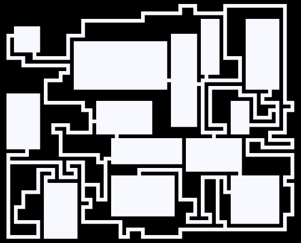

# 随机地牢生成器

``` csharp
public class RectangularDungeonGenerator
```

## 同步函数

``` csharp
public RectangularDungeonField Create(int width, 
                                    int height, 
                                    int minRoomWidth, 
                                    int maxRoomWidth, 
                                    int minRoomHeight, 
                                    int maxRoomHeight, 
                                    int maxRoomCount, 
                                    int mulConnector,
                                    int tortuosity,
                                    RectangularDungeonAlgorithm algorithm = RectangularDungeonAlgorithm.Nystroms)
```

## 异步函数

``` csharp
public await Task<RectangularDungeonField> CreateAsync(int width, 
                                                     int height, 
                                                     int minRoomWidth, 
                                                     int maxRoomWidth, 
                                                     int minRoomHeight, 
                                                     int maxRoomHeight, 
                                                     int maxRoomCount, 
                                                     int mulConnector,
                                                     int tortuosity,
                                                     RectangularDungeonAlgorithm algorithm = RectangularDungeonAlgorithm.Nystroms)
```

## 参数

- **width**  宽度
- **height** 高度
- **minRoomWidth** 房间最小宽度
- **maxRoomWidth** 房间最大宽度
- **minRoomHeight** 房间最小高度
- **maxRoomHeight** 房间最大高度
- **maxRoomCount** 房间最大数量
- **mulConnector** 多联通概率
- **tortuosity** 走廊曲折度
- **algorithm** 生成算法，提供了两种生成矩形地牢的算法
    - Nystroms
    - OverlapR

## 示例

``` csharp
var generator = new RectangularDungeonGenerator();
dunggeneratoreon.Create(width,
                        height,
                        roomMinWidth,
                        roomMaxWidth,
                        roomMinHeight,
                        roomMaxHeight,
                        roomCount,
                        mulconnector,
                        tortuosity,
                        RectangularDungeonAlgorithm.Nystroms);
```

## 效果

