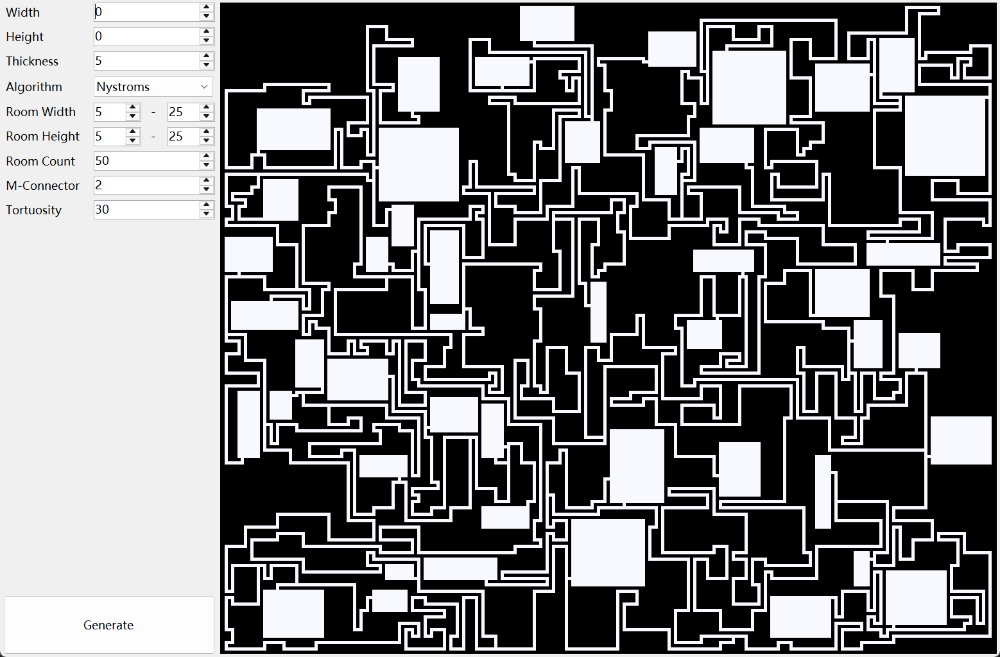

# 地牢生成器

``` csharp
public class RectangularMazeGenerator
{
    // 同步函数
    public RectangularDungeonField Create(int width, 
                                          int height, 
                                          int minRoomWidth, 
                                          int maxRoomWidth, 
                                          int minRoomHeight, 
                                          int maxRoomHeight, 
                                          int maxRoomCount, 
                                          int mulConnector,
                                          int tortuosity,
                                          DungeonAlgorithm algorithm = DungeonAlgorithm.Nystroms);
    // 异步函数
    public async Task<RectangularDungeonField> CreateAsync(int width, 
                                                           int height, 
                                                           int minRoomWidth, 
                                                           int maxRoomWidth, 
                                                           int minRoomHeight, 
                                                           int maxRoomHeight, 
                                                           int maxRoomCount, 
                                                           int mulConnector,
                                                           int tortuosity,
                                                           DungeonAlgorithm algorithm = DungeonAlgorithm.Nystroms);
    }
```

### 参数

- **width** 宽度
- **height** 高度
- **minRoomWidth** 房间最小宽度
- **maxRoomWidth** 房间最大宽度
- **minRoomHeight** 房间最小高度
- **maxRoomHeight** 房间最大高度
- **maxRoomCount** 最大房间数
- **mulConnector** 多联通概率
- **tortuosity** 走廊曲折度
- **algorithm** 算法

## 示例

``` csharp
var generator = new RectangularDungeonGenerator();
generator.Create(width, 
                 height, 
                 minRoomWidth, 
                 maxRoomWidth, 
                 minRoomHeight, 
                 maxRoomHeight, 
                 maxRoomCount, 
                 mulConnector,
                 tortuosity,
                 DungeonAlgorithm.Nystroms);
```

## 效果

