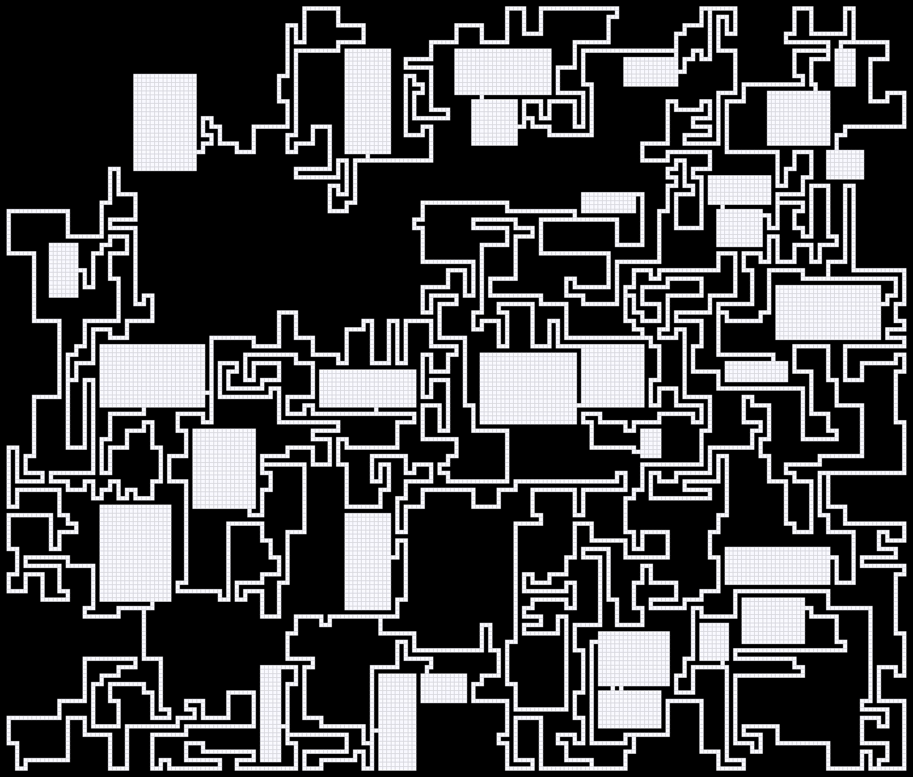
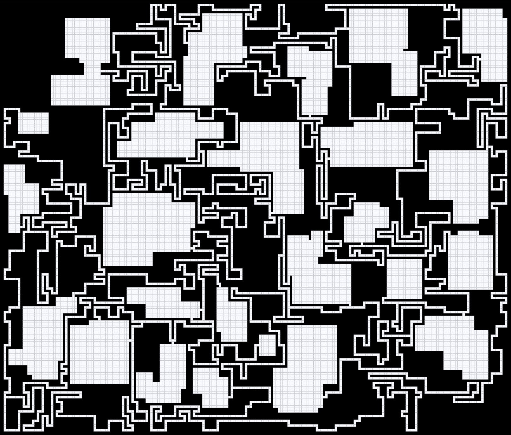

# 随机地牢生成器

包含两个模块

- [生成器](#生成器)
- [序列化](#序列化)

## 生成器

``` csharp
public class RectangularMazeGenerator
{
    // 同步函数
    public RectangularDungeonField Create(int width, 
                                          int height, 
                                          int minRoomWidth, 
                                          int maxRoomWidth, 
                                          int minRoomHeight, 
                                          int maxRoomHeight, 
                                          int maxRoomCount, 
                                          int mulConnector,
                                          int tortuosity,
                                          DungeonAlgorithm algorithm = DungeonAlgorithm.Nystroms)；

    //  异步函数
    public async Task<RectangularDungeonField> CreateAsync(int width, 
                                                           int height, 
                                                           int minRoomWidth, 
                                                           int maxRoomWidth, 
                                                           int minRoomHeight, 
                                                           int maxRoomHeight, 
                                                           int maxRoomCount, 
                                                           int mulConnector,
                                                           int tortuosity,
                                                           DungeonAlgorithm algorithm = DungeonAlgorithm.Nystroms)；
}
```

### 参数

- **width** 宽度
- **height** 高度
- **minRoomWidth** 房间最小宽度
- **maxRoomWidth** 房间最大宽度
- **minRoomHeight** 房间最小高度
- **maxRoomHeight** 房间最大高度
- **maxRoomCount** 最大房间数
- **mulConnector** 多联通概率
- **tortuosity** 走廊曲折度
- **algorithm** 算法
    - Nystroms
    - OverlapR

### 示例

#### Nystroms

``` csharp
var generator = new RectangularDungeonGenerator();
generator.Create(215, 183, 5, 25, 5, 25, 30, 2, 50, DungeonAlgorithm.Nystroms);
```



#### OverlapR

``` csharp
var generator = new RectangularDungeonGenerator();
generator.Create(215, 183, 5, 25, 5, 25, 30, 2, 50, DungeonAlgorithm.OverlapR);
```



## 序列化

### 写入

``` csharp
public class DungeonWriter
{
    // 同步函数
    public bool Write(RectangularDungeonField field, MemoryStream stream);
    // 异步函数
    public async Task<bool> WriteAsync(RectangularDungeonField field, MemoryStream stream);
}
```

### 读取

``` csharp
public class DungeonReader
{
    // 同步函数
    public RectangularDungeonField Read(MemoryStream stream);
    // 异步函数
    public async Task<RectangularDungeonField> ReadAsync(MemoryStream stream);
}
```